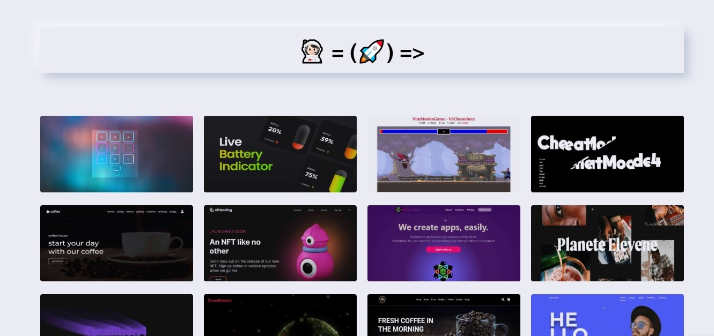

<a align="center" href="https://github.com/ryo-ma/github-profile-trophy">
  

  
</a>

# [LIVE-DEMO](https://rroderickk.github.io/Deploy_library/)

[NEWMORPHISM](https://rroderickk.github.io/Deploy_library/)
<a href="https://rroderickk.github.io/Deploy_library/">
  

    
  

</a>

<!-- ----------------------------------------------------------------------------- -->

[Me](https://rroderickk.github.io/me/)
<a href="https://rroderickk.github.io/me/">
  

    
  

</a>

[BeatBoxJs](https://rroderickk.github.io/beatBoxJS/)
<a href="https://rroderickk.github.io/beatBoxJS/">
  

    
  

</a>

[live-battery-level](https://rroderickk.github.io/battery-level-indicator/)
<a href="https://rroderickk.github.io/battery-level-indicator/">
  

    
  

</a>

[vim-Cheatsheet](https://rroderickk.github.io/vimVSC_cheatSheet/)
<a href="https://rroderickk.github.io/vimVSC_cheatSheet/">
  

    
  

</a>

[the-substance](https://rroderickk.github.io/the-substance/)
<a href="https://rroderickk.github.io/the-substance/">
  

    
  

</a>

[coffe_website](https://rroderickk.github.io/coffe_website/)
<a href="https://rroderickk.github.io/coffe_website/">
  

    
  

</a>

[nft-landing](https://rroderickk.github.io/nftlanding/)
<a href="https://rroderickk.github.io/nftlanding/">
  

    
  

</a>

[keepsimpleweb](https://keepsimpleweb.github.io/)
<a href="https://keepsimpleweb.github.io/">
  

    
  

</a>

[Igallery](https://rroderickk.github.io/Igallery/)
<a href="https://rroderickk.github.io/Igallery/">
  

    
  

</a>

[Text-trail-effect](https://rroderickk.github.io/text-trail-effect/)
<a href="https://rroderickk.github.io/text-trail-effect/">
  

    
  

</a>

[3d-particles](https://rroderickk.github.io/Three.js-Particle-Earth/)
<a href="https://rroderickk.github.io/Three.js-Particle-Earth/">
  

    
  

</a>

[coffe-website_dos](https://rroderickk.github.io/coffee_website/)
<a href="https://rroderickk.github.io/coffee_website/">
  

    
  

</a>

[responsive-portfolio](https://rroderickk.github.io/responsive-portfolio-website/)
<a href="https://rroderickk.github.io/responsive-portfolio-website/">
  

    
  

</a>

[portfolio-personal](https://rroderickk.github.io/portfolio-personal/)
<a href="https://rroderickk.github.io/portfolio-personal/">
  

    
  

</a>

[eleveNmaps-cybersecurity](https://rroderickk.github.io/EleveNmaps/)
<a href="https://rroderickk.github.io/EleveNmaps/">
  

    
  

</a>

[s4htb-maquinas-hechas-por-s4vitar-youtuber-cybersecurity](https://rroderickk.github.io/s4htb)
<a href="https://rroderickk.github.io/s4htb">
  

    
  

</a>

[todo-app-hardmode](https://rroderickk.github.io/firstapp1/)
<a href="https://rroderickk.github.io/firstapp1/">
  

    
  

</a>

[my-cv](https://rroderickk.github.io/cv2/)
<a href="https://rroderickk.github.io/cv2/">
  

    
  

</a>

[nodemachine](https://github.com/rroderickk/nodemachine)
<a href="https://github.com/rroderickk/nodemachine">
  

  
  

</a>

[trofeos-de-platzi](https://rroderickk.github.io/TempCv1/)
https://rroderickk.github.io/TempCv1/
<a href="">
  

    
  

</a>

[platzi-badges](https://rroderickk.github.io/platzibadges)
<a href="https://rroderickk.github.io/platzibadges">
  

    
  

</a>

[platzi-agenda-model-router](https://rroderickk.github.io/platziagenda/)
<a href="https://rroderickk.github.io/platziagenda/">
  

    
  

</a>

[professional](https://rroderickk.github.io/professional/)
<a href="https://rroderickk.github.io/professional/">
  

    
  

</a>

[cryptomonedas-papapabit](https://rroderickk.github.io/mobilefirst)
<a href="https://rroderickk.github.io/mobilefirst">
  

    
  

</a>

[mock-sale](https://rroderickk.github.io/reactPractico/)
<a href="https://rroderickk.github.io/reactPractico/">
  

    
  

</a>

[blog-in-progress](https://rroderickk.github.io/)
<a href="https://rroderickk.github.io/">
  

    
  

</a>

[vsc-theme-matrixResolutions4128](https://github.com/rroderickk/matrixResolutions)
<a href="https://github.com/rroderickk/matrixResolutions">
  

    
  

</a>
<a href="">
  

    
  

</a>

[markdown-previsualizer](https://github.com/rroderickk/MardownPrevisualizer)
<a href="https://github.com/rroderickk/MardownPrevisualizer">
  

    
  

</a>

[simply-countdown](https://rroderickk.github.io/countdown/)
<a href="https://rroderickk.github.io/countdown/">
  

    
  

</a>
